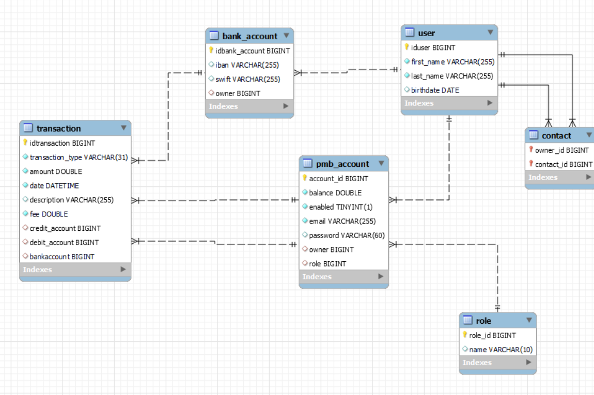

#  
Secured API developed with Spring, that allows transactions between users and bank.

---------
## Getting Started

These instructions will get you a copy of the project up and running on your local machine

### Prerequisites

[Java 11 +](https://adoptopenjdk.net/?variant=openjdk11&jvmVariant=hotspot)  
[Maven 3.6.2](https://maven.apache.org/download.cgi)  
[MySQL](https://dev.mysql.com/downloads/mysql/)

### Running App

To run the app, go to folder `PayMyBuddyAPI`

1. To set up the tables and data in the data base. For this, please run the sql commands present in the *schema.sql* file.

2. Compile and generate the final jar by running command: `mvn package`

3. Run the APP with: `mvn spring-boot:run -Dspring-boot.run.arguments="--spring.datasource.username=`*database username* `--spring.datasource.password=`*database password*`"`

### Testing

To run the tests execute the command: `mvn verify`  
To generate the project's reports site, please run :`mvn site`
---------
##  API endpoints

__Endpoints__
*Authentication endpoints*
* POST http://localhost:8080/sign-in : return JWT 

*User endpoints*
* GET http://localhost:8080/api/account : get user profile
* POST http://localhost:8080/api/account : to save new User
* PUT http://localhost:8080/api/account : to update a user
* DELETE http://localhost:8080/api/account : to delete a user

*Transfer endpoints*
* GET http://localhost:8080/transfer : get All fire transfers
* POST http://localhost:8080/transfer :to save new transfer

*Payment endpoints*
* GET http://localhost:8080/payment : get All fire payments
* POST http://localhost:8080/payment :to save new payment

*Contact endpoints*
* GET http://localhost:8080/contact : get All contacts
* POST http://localhost:8080/contact :to add new contact
* DELETE http://localhost:8080/contact :to delete contact from contacts list

*BanKAccount endpoints*
* GET http://localhost:8080/bankAccount : get Bank account
* POST http://localhost:8080/bankAccount :to save Bank account
* PUT http://localhost:8080/bankAccount :to update bank account
---------
##  Domain Model

### UML

### MPD

